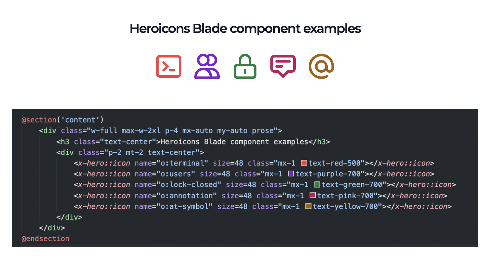

# Heroicons Blade component

> Heroicons as a Blade component using \<x-hero::icon></x-hero::icon> in your Laravel App.


`<x-hero::icon name="o:terminal" size="56"></x-hero::icon>`

The package is using Heroicons as SVG Icons source repository and using its grouping as icon naming in the component's props.

- Tajid Yakub <tajid.yakub@gmail.com>
- https://github.com/tajidyakub/heroicons-blade.git


## Installation

Install through `composer` in your laravel app. Icons from Heroicons will be instantly available in your Laravel Views using blade componennt `<x-hero::icon></x-hero::icon`>

`composer require tjd/heroicons-blade`

The package comes with javascript and svg icons assets which need to be published in to your laravel app directory, execute publish artisan command after the package required.

`php artisan vendor:publish --provider="Tj\Icon\HeroiconsBladeServiceProvider" --tag="assets"`

You need to attach the javascript file, if the app is using blade's layout, this could be put on the script section of the main layout.

```javascript
<script src="/heroicons/assets/heroicons.js"></script>
```

## Component's props and usage

Component `hero::icon` will have these props which you can adjust.

```php
@props([
    'name' => 'o:user', // the default icon use o: for outline and s: for solid
    'size' => 24,       // default size, used for width and height of the svg icon
    'color' => none     // used for icon's fill color 
])
```

By adjusting the `name` prop, component will be able to display Heroicons svg icon with the same name, for example `o:user` translated into `outline/user.svg`.

`class` attribute will be merged into `svg` element, any class attribute values defined on the `<x-hero::icon>` will be defined directly in the `svg` element.

```php
<!-- outline/terminal icon with 48 width and height -->
<x-heroicon size=48 name="o:terminal"></x-heroicon>
```



## Further styling

Further styling using css is possible by creating a css class called `.tj-heroicons` the class is binded with the svg element therefor you could insert style properties in it.

## What it does

Translated `name` props will be used by `url` in the same host with laravel app and `fetch` the icon content from the public `heroicons/icons` dir which by default is using `public/icons/`, the copy proccess was done when the assets published with `vendor:publish`.

## Development

It is a simple package, further development can be made by enhancing the javascript file in the `resources/script/` dir and `icon` anonymous component template in `resources/views/components/` dir.

## References

- Heroicons https://heroicons.com/.
- Heroicons Git Repo https://github.com/tailwindlabs/heroicons, is cloned as a submodule in this repo inside `resources/`.
